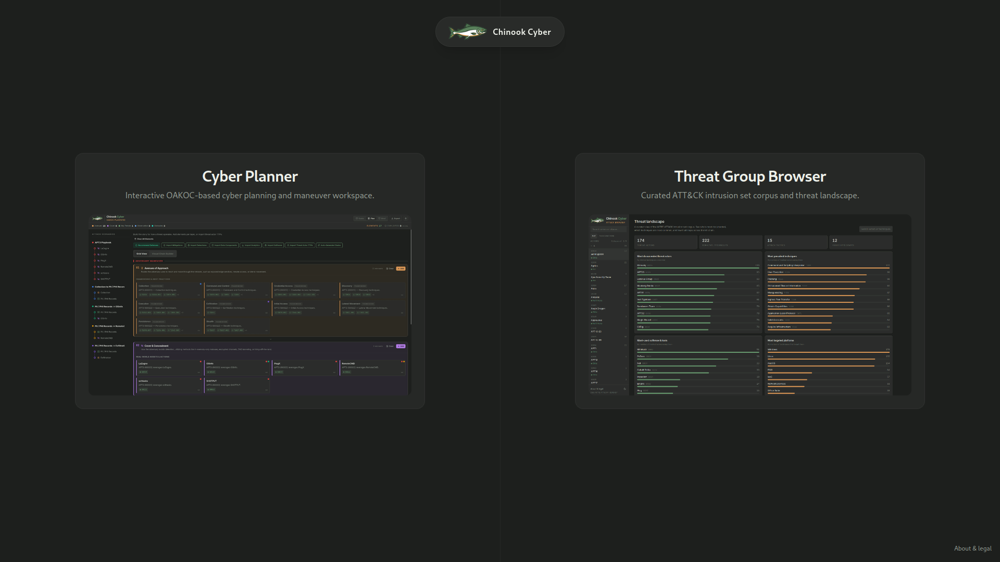
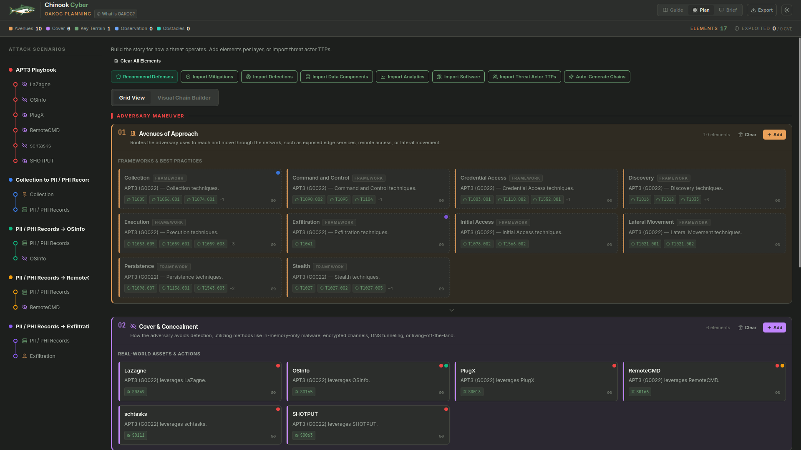
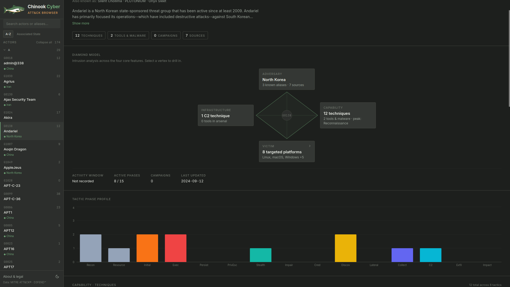

# Portfolio

Hey there! This is a collection of my recent projects, ranging from cyber threat intelligence tools to home lab networking and web development.

---

## The Projects

### Chinook Cyber Ecosystem
A suite of tools for threat intelligence and cyber defense planning.

- **[Homepage](https://github.com/gjoncay/chinookcyber_homepage)** — A simple splash page and portal linking the ecosystem together, built with Next.js 16 and Tailwind 4.
  
  

- **[CyberSandBox (Cyber Planner)](https://github.com/gjoncay/cyber-planning-web-app)** — An interactive workspace that applies US Army OAKOC principles to cyber defense. It lets you map out network terrain, pull in live vulnerability metrics (like CISA KEV or EPSS), and toggle between technical and executive views. *(Next.js, React Flow, Zustand)*
  
  

- **[MITRE Diamond Dashboard](https://github.com/gjoncay/chinook-cti)** — An ATT&CK browser based on the Diamond Model of Intrusion Analysis. Instead of a flat wiki, it maps out threat actors, their tactics, and recommended defensive countermeasures using MITRE D3FEND data. *(React, Vite, Recharts)*
  
  

### Network & Traffic Analysis

- **[MikroTik ELK Stack](https://github.com/gjoncay/ELK-homelan)** — A Docker-based Elastic stack for analyzing my home network. It grabs IPFIX and packet captures from a MikroTik router, enriches the traffic with Zeek (for IP-to-domain mapping), and visualizes it in Kibana. Securely exposed via a Tailscale sidecar.
- **[Netflow Data Dashboard](https://github.com/gjoncay/IPFIX_Dashboard)** — A Streamlit dashboard for NetFlow/IPFIX records. It parses `nfcapd` files into DuckDB, adds GeoIP/ASN context, and surfaces traffic analytics and basic beacon detection.

### Web Apps & Dashboards

- **[Sophie Counseling Site](https://github.com/gjoncay/sophie-counseling-site)** — A freelance project for a mental health practice. Focuses on accessibility, strong SEO, and a calming aesthetic with custom CSS and React.
  
  https://github.com/gjoncay/portfolio/raw/master/assets/sophie-site-demo.mp4
- **[Seattle Move App](https://github.com/gjoncay/seattle-move-app)** — A custom dashboard I built to manage a PCS move. It tracks countdowns, phase-based checklists, and potential housing options on an interactive Leaflet map. *(Next.js, Supabase)*
- **[Cycling Dashboard](https://github.com/gjoncay/cycling-dashboard)** — A self-hosted dashboard for my Strava data. Includes dark-mode route heatmaps and a markdown journal for keeping track of bike maintenance and ride notes. *(FastAPI, SQLite, Chart.js)*
- **[Kanban To-Do](https://github.com/gjoncay/kanban-todo)** — A tiny, dependency-free shared Kanban board. It's just a static page and a basic Node server that saves state to a local JSON file. Runs securely behind Tailscale.

### Misc & Tools

- **App Template** — A quick Docker boilerplate for spinning up internal web apps behind Tailscale sidecars with auto-provisioned HTTPS.
- **Threat Horizon PRC Masterclass** — A collection of scripts, text-to-speech processing pipelines, and notes used to generate briefings on the PRC threat landscape.

---

*Screenshots and more detailed documentation are available in the individual repositories.*
